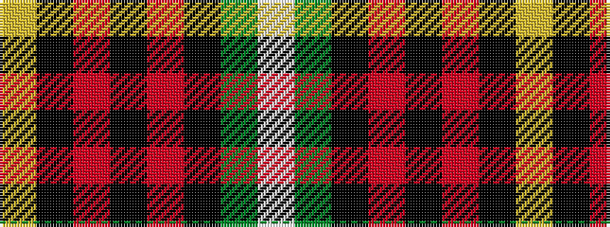

WGKRKRKY

It is a 8 stripe tartan.

<figure class="pat-woven">

<figcaption>idealised sample</figcaption>
</figure>

## Colour Sequence



## Tartans with this colour sequence

| Tartans |
|---------------|
| [Hoa Sen](/setts/s8/ly8k2r23k1r17k1g4w3~x2/)|
||
