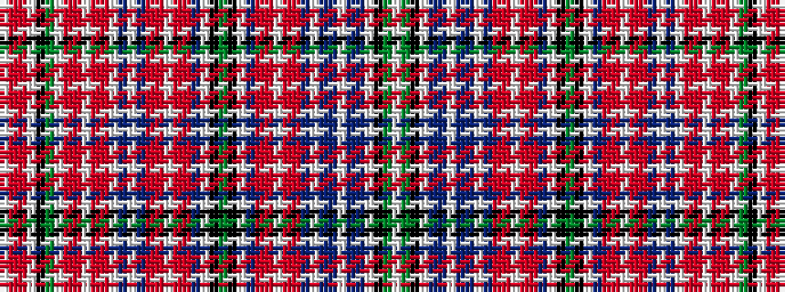

WGKWBBWBBWBRRWRRBWKGKWBRRWRRBWBWRRWRRWGKWRRW

It is a 44 stripe tartan.

<figure class="pat-woven">

<figcaption>idealised sample</figcaption>
</figure>

## Colour Sequence



## Tartans with this colour sequence

| Tartans |
|---------------|
| [Aberdeen](/variants/s44/w2g4k16w2p6t4w2t4p6w2p3ri8r3w2r3ri8p3w2k12g4k12w2p3ri8r3w2r3ri8p3w2t10w2ri6r3w1r3ri6w2g4k16w2ri23r3w2~x2/)|
||
