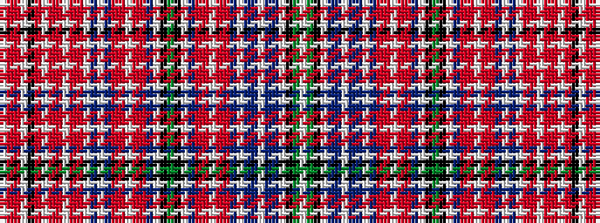

WGKWBBWBBWBRRWRRBWKGKWBRRWRRBWBWRRWRRWRKWRRW

It is a 44 stripe tartan.

<figure class="pat-woven">

<figcaption>idealised sample</figcaption>
</figure>

## Colour Sequence



## Tartans with this colour sequence

| Tartans |
|---------------|
| [Aberdeen District Tartan](/variants/s44/w2g4k16w2dp6t4w2t4dp6w2dp3r8ri3w2ri3r8dp3w2k12g4k12w2dp3r8ri3w2ri3r8dp3w2t10w1r6ri3w1ri3r6w1ri4k16w2r23ri3w2~x2/)|
||
