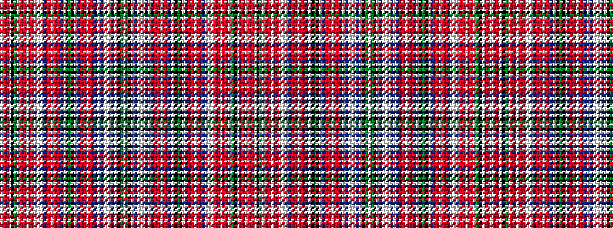

WGKWBWWWBWBRRWRRBWKGKWBRRWRRBWWWRRWRRWGKWRRW

It is a 44 stripe tartan.

<figure class="pat-woven">

<figcaption>idealised sample</figcaption>
</figure>

## Colour Sequence



## Tartans with this colour sequence

This pattern is a design lineage: every tartan below shares one colour order, whatever its owner —
near-identical designs are grouped, the largest lineage first (#112: the pattern is a tartan's
second parent, beside its family or clan).

<table class="sett-table">
<tbody>
<tr><td><a href="/variants/s44/w2g4k16w2dp6lb4w2lb4dp6w2dp3r8ri3w2ri3r8dp3w2k12g4k12w2dp3r8ri3w2ri3r8dp3w2lb10w1r6ri3w1ri3r6w1g4k16w2r23ri3w2~x2~r2209032-ri2806019/">Aberdeen - 1819 (District)</a></td></tr>
<tr><td class="sett-swatch"></td></tr>
</tbody>
</table>

