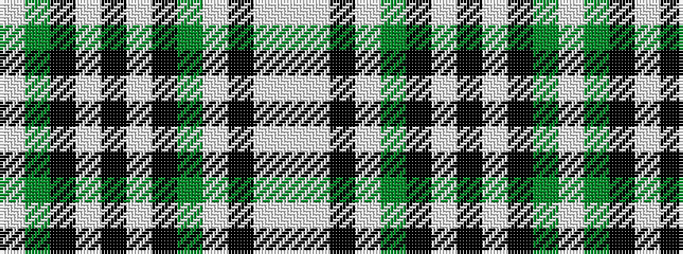

WGKWKWKGWKWW

It is a 12 stripe tartan.

<figure class="pat-woven">

<figcaption>idealised sample</figcaption>
</figure>

## Colour Sequence



## Tartans with this colour sequence

| Tartans |
|---------------|
| [Glen Moy](/variants/s12/lb98y12k16w5k5w5k5y28lb16k5lb16w6/)|
||
