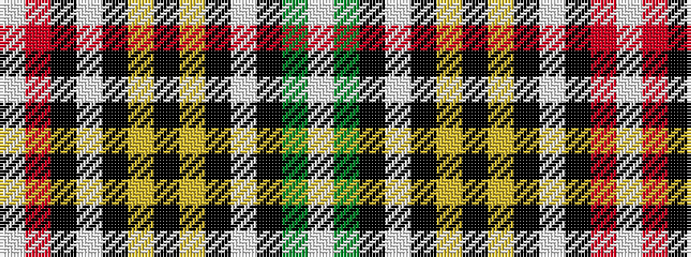

WGKWKYKYKWKRW

It is a 13 stripe tartan.

<figure class="pat-woven">

<figcaption>idealised sample</figcaption>
</figure>

## Colour Sequence



## Tartans with this colour sequence

| Tartans |
|---------------|
| [Buchanan D](/variants/s13/lb2dg16k1lb2k1ly4k1ly4k1lb2k1r16lb2~x2/)|
||
| [Buchanan D1](/variants/s13/lb2r16k1lb2k1ly4k1ly4k1lb2k1g16lb2~x2/)|
||
