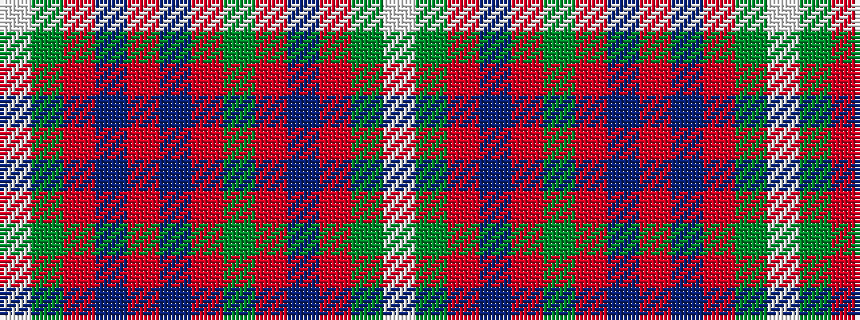

WGRBRBRGRBRGW

It is a 13 stripe tartan.

<figure class="pat-woven">

<figcaption>idealised sample</figcaption>
</figure>

## Colour Sequence



## Tartans with this colour sequence

| Tartans |
|---------------|
| [Robertson 1820 - White line](/setts/s13/w1g2r18db2r2db18r2g18r2db2r18g2w1~x2/)|
||
