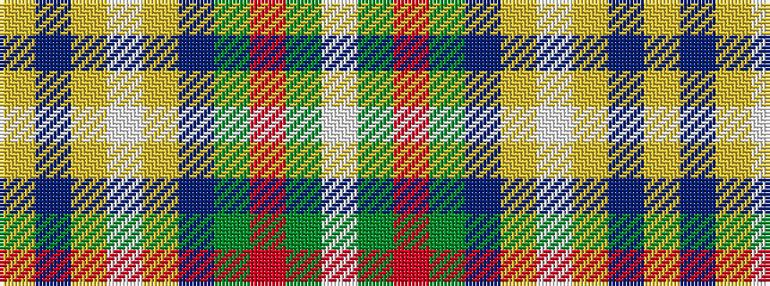

WGRGBYWYBY

It is a 10 stripe tartan.

<figure class="pat-woven">

<figcaption>idealised sample</figcaption>
</figure>

## Colour Sequence



## Tartans with this colour sequence

| Tartans |
|---------------|
| [John, Hamilton Gray](/variants/s10/w8g14r6g24db30ly10w40ly10db7ly4/)|
||
