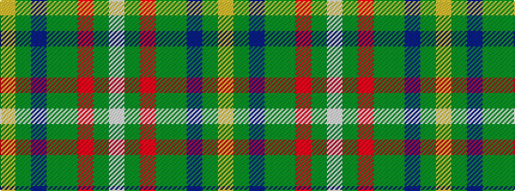

WGRGGBGY

It is a 8 stripe tartan.

<figure class="pat-woven">

<figcaption>idealised sample</figcaption>
</figure>

## Colour Sequence



## Tartans with this colour sequence

| Tartans |
|---------------|
| [Etienne Paschal Tache Sir... Canadian Tartan](/variants/s8/w3dy1r29dy16g23db3g3ly2~x2/)|
||
| [Tache, Sir Etienne Paschal #2](/variants/s8/w3dy1r29dy16dg23db3dg3lo2~x2/)|
||
