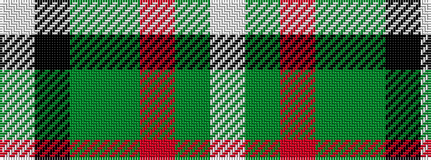

WGRGGKW

It is a 7 stripe tartan.

<figure class="pat-woven">

<figcaption>idealised sample</figcaption>
</figure>

## Colour Sequence



## Tartans with this colour sequence

| Tartans |
|---------------|
| [Lundy (Personal)](/setts/s7/lb2k2g8g8r1g1w1~x4/)|
||
