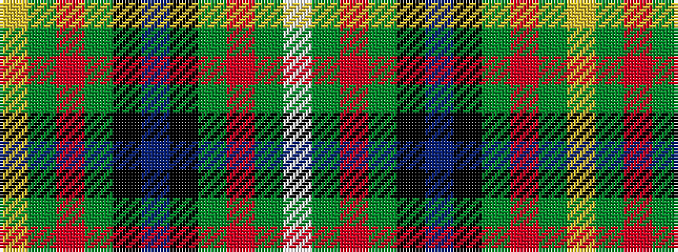

WGRGKBKGRGY

It is a 11 stripe tartan.

<figure class="pat-woven">

<figcaption>idealised sample</figcaption>
</figure>

## Colour Sequence



## Tartans with this colour sequence

| Tartans |
|---------------|
| [Loch Tay (District)](/variants/s11/lo3y3r2y16k2db24k2y16r2y3lb3~x2/)|
||
