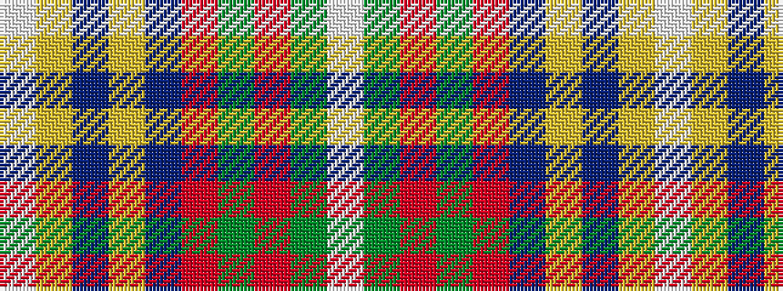

WGRGRBYBYW

It is a 10 stripe tartan.

<figure class="pat-woven">

<figcaption>idealised sample</figcaption>
</figure>

## Colour Sequence



## Tartans with this colour sequence

| Tartans |
|---------------|
| [O'Mahony, The (Commemorative)](/variants/s10/w2lo4db1lo1db40o6g18r2g2w1~x2/)|
||
