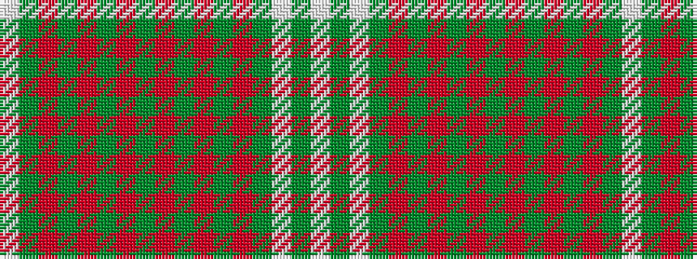

WGRGRGRGRGRGRGWGW

It is a 17 stripe tartan.

<figure class="pat-woven">

<figcaption>idealised sample</figcaption>
</figure>

## Colour Sequence



## Tartans with this colour sequence

| Tartans |
|---------------|
| [Rothesay Hunting (District)](/variants/s17/w8g83r7g5r7g7r28g7r28g7r7g5r7g83w4g4w8/)|
||
| [Rothesay, hunting](/variants/s17/w2g32r2g3r2g4r16g4r16g4r2g3r2g32w1g1w2~x2/)|
||
