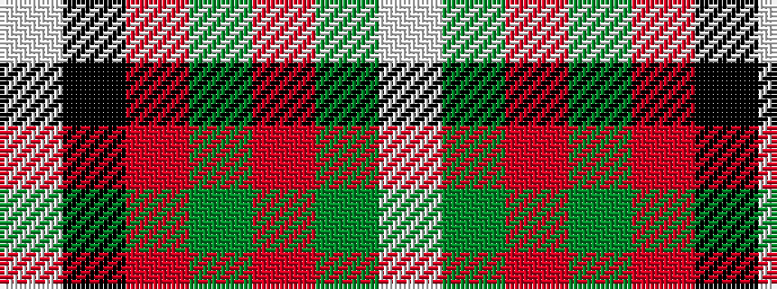

WGRGRKW

It is a 7 stripe tartan.

<figure class="pat-woven">

<figcaption>idealised sample</figcaption>
</figure>

## Colour Sequence



## Tartans with this colour sequence

| Tartans |
|---------------|
| [MacMaster (USA) #1](/setts/s7/lb2g6r1g1r14k1lbi1~x4/)|
||
