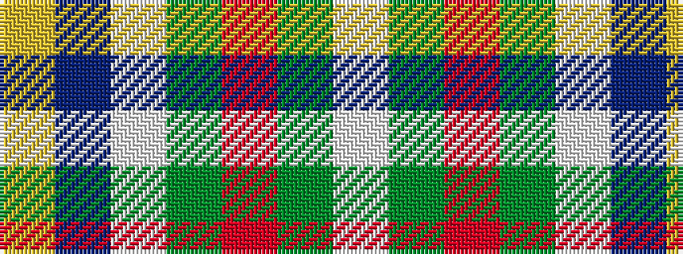

WGRGWBY

It is a 7 stripe tartan.

<figure class="pat-woven">

<figcaption>idealised sample</figcaption>
</figure>

## Colour Sequence



## Tartans with this colour sequence

| Tartans |
|---------------|
| [Atikokan (District)](/setts/s7/lo6t16lb3y3o3g3w2~x4/)|
||
