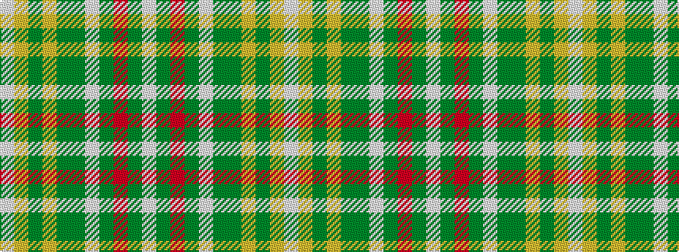

WGRGWGGYGYW

It is a 11 stripe tartan.

<figure class="pat-woven">

<figcaption>idealised sample</figcaption>
</figure>

## Colour Sequence



## Tartans with this colour sequence

| Tartans |
|---------------|
| [Glenmore Green Fashion Tartan](/variants/s11/w38y10m2y3w2y3g8lr3y2lr3w2~x2/)|
||
