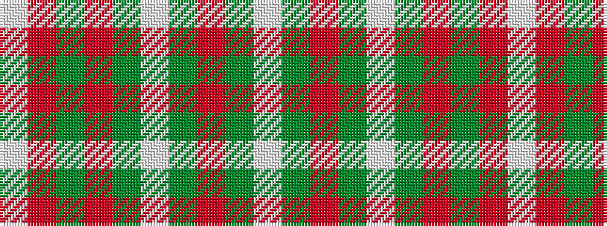

WGRGWGRGRW

It is a 10 stripe tartan.

<figure class="pat-woven">

<figcaption>idealised sample</figcaption>
</figure>

## Colour Sequence



## Tartans with this colour sequence

| Tartans |
|---------------|
| [Strathyre dress](/variants/s10/w49dg11r2dg3w2dy10m9dg2m6w2~x2/)|
||
