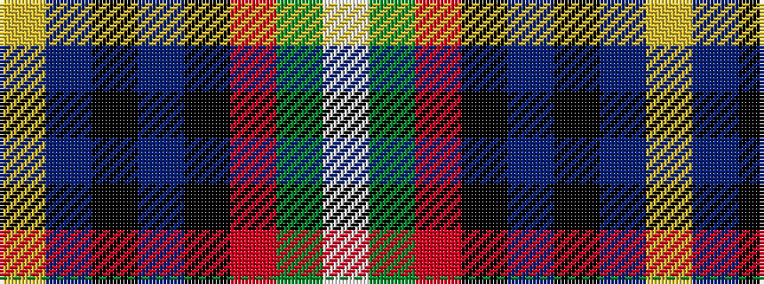

WGRKBKBY

It is a 8 stripe tartan.

<figure class="pat-woven">

<figcaption>idealised sample</figcaption>
</figure>

## Colour Sequence



## Tartans with this colour sequence

| Tartans |
|---------------|
| [Loch Etive](/setts/s8/w3g2r21k26db18k2db3ly3~x2/)|
||
| [Loch Etive](/setts/s8/ly3db3k2db18k26r21g2lb3~x2/)|
||
