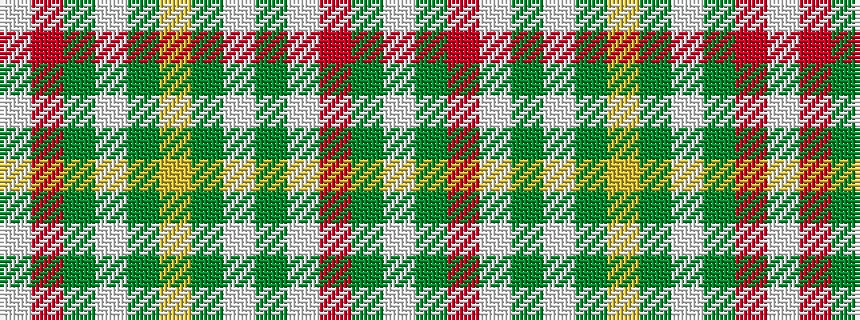

WGRWGWGYGWGRW

It is a 13 stripe tartan.

<figure class="pat-woven">

<figcaption>idealised sample</figcaption>
</figure>

## Colour Sequence



## Tartans with this colour sequence

| Tartans |
|---------------|
| [Veron](/variants/s13/w12dg2o2w5dg31w5dg2ly5dg2w11dg2o2w2~x2/)|
||
