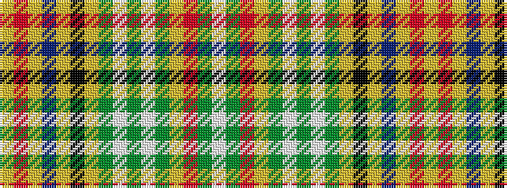

WGRYGWGWGYKYBYRY

It is a 16 stripe tartan.

<figure class="pat-woven">

<figcaption>idealised sample</figcaption>
</figure>

## Colour Sequence



## Tartans with this colour sequence

| Tartans |
|---------------|
| [Dalrymple of Castleton #2](/setts/s16/ly2r15ly2dr2ly2k14ly2g10w1g6w1g10ly2r7g10w1~x2/)|
||
