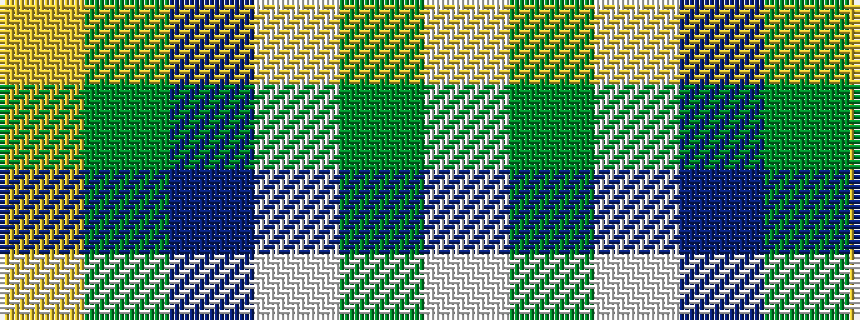

WGWBGY

It is a 6 stripe tartan.

<figure class="pat-woven">

<figcaption>idealised sample</figcaption>
</figure>

## Colour Sequence



## Tartans with this colour sequence

| Tartans |
|---------------|
| [Nynashamn Whisky Society (Corporate)](/setts/s6/ly21g26db62w2dg2w2/)|
||
