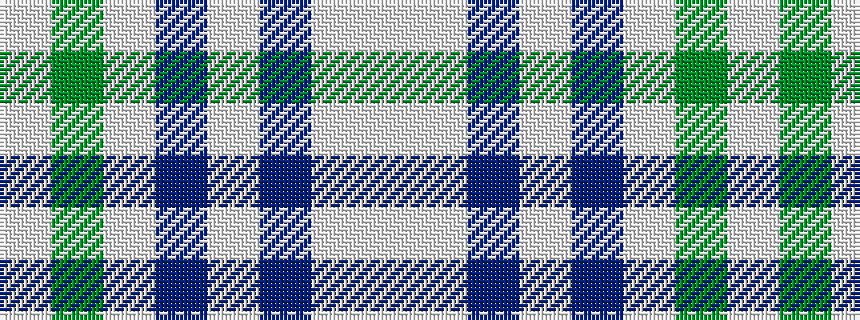

WGWBWBWW

It is a 8 stripe tartan.

<figure class="pat-woven">

<figcaption>idealised sample</figcaption>
</figure>

## Colour Sequence



## Tartans with this colour sequence

| Tartans |
|---------------|
| [Tenmaya](/setts/s8/w3y36lp6b6lp6b12lp32w3/)|
||
