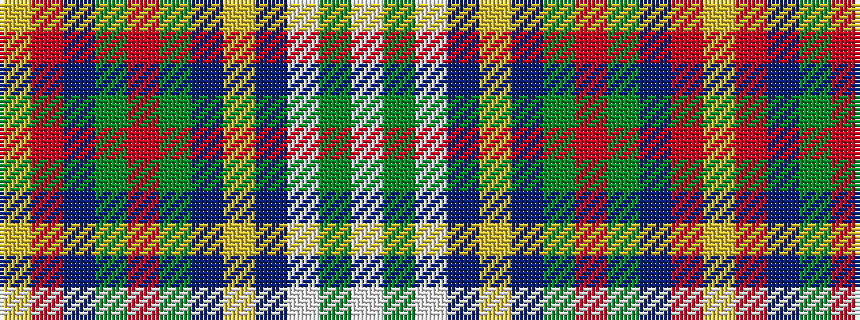

WGWBYBGRGBRY

It is a 12 stripe tartan.

<figure class="pat-woven">

<figcaption>idealised sample</figcaption>
</figure>

## Colour Sequence



## Tartans with this colour sequence

| Tartans |
|---------------|
| [E.C.R. (Corporate)](/setts/s12/lb16g2lb16db18ly2db13g11r2g9db12r2ly2~x2/)|
||
