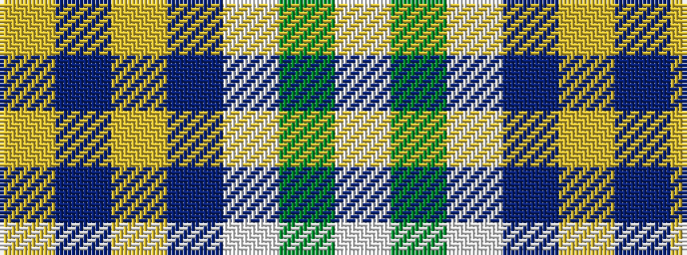

WGWBYBY

It is a 7 stripe tartan.

<figure class="pat-woven">

<figcaption>idealised sample</figcaption>
</figure>

## Colour Sequence



## Tartans with this colour sequence

| Tartans |
|---------------|
| [Clackson Arisaid (Name?)](/setts/s7/w24g2w8db5ly4db5ly4~x2/)|
||
