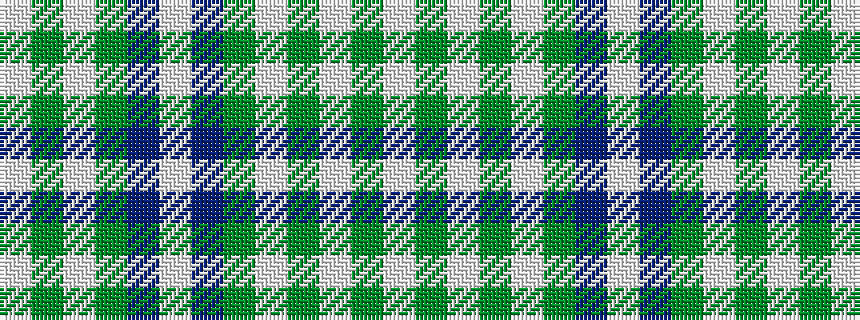

WGWGBWBGWGWGW

It is a 13 stripe tartan.

<figure class="pat-woven">

<figcaption>idealised sample</figcaption>
</figure>

## Colour Sequence



## Tartans with this colour sequence

| Tartans |
|---------------|
| [Poulter SG 096 (Fashion)](/setts/s13/w25g8w8g8w8g46t46w8t46g46w46g8w8/)|
||
