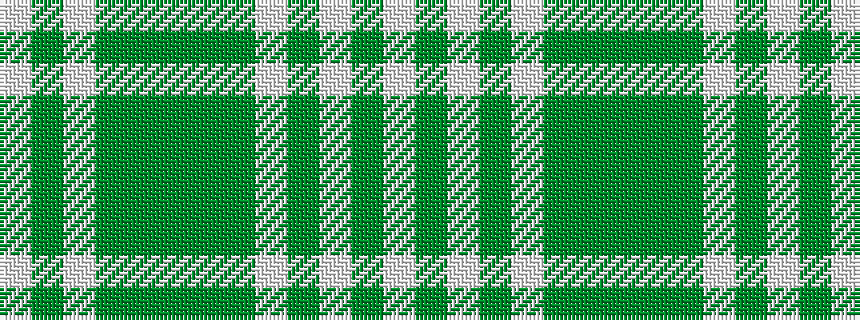

WGWGGGGGWGWGW

It is a 13 stripe tartan.

<figure class="pat-woven">

<figcaption>idealised sample</figcaption>
</figure>

## Colour Sequence



## Tartans with this colour sequence

| Tartans |
|---------------|
| [MacLachlan, Brown Dress (Fashion)](/variants/s13/lb16dy2lb2dy2lb2dy16dy16g3dy16dy16lb16dy2lb2~x2/)|
||
