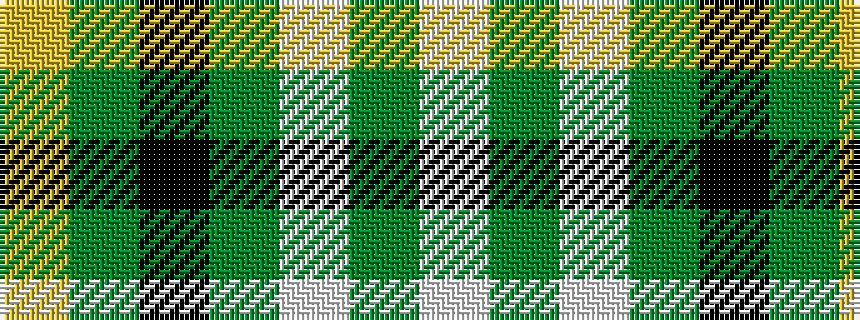

WGWGKGY

It is a 7 stripe tartan.

<figure class="pat-woven">

<figcaption>idealised sample</figcaption>
</figure>

## Colour Sequence



## Tartans with this colour sequence

| Tartans |
|---------------|
| [Cunningham Dress Green (Dance)](/variants/s7/w5g2w34g34k2g2ly4~x2/)|
||
| [Cunningham Dress Green (Dance) Fashion Tartan](/variants/s7/w2g1w20g20k1g1ly2~x4/)|
||
