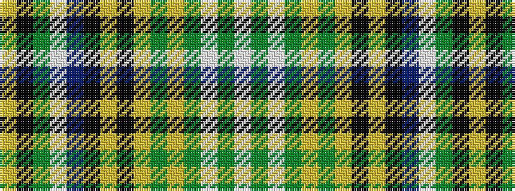

WGWGYGYKYKBWGKY

It is a 15 stripe tartan.

<figure class="pat-woven">

<figcaption>idealised sample</figcaption>
</figure>

## Colour Sequence



## Tartans with this colour sequence

| Tartans |
|---------------|
| [Wexford County Crest (Fashion)](/variants/s15/w6y6w6y12lr8y14lo24k4lr4k4dp44w12y20k4lr5/)|
||
