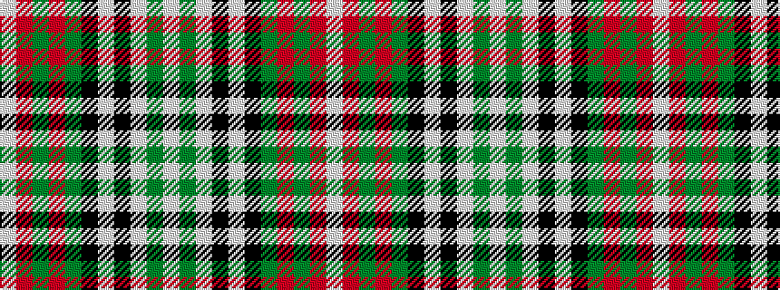

WGWKWKGRGRW

It is a 11 stripe tartan.

<figure class="pat-woven">

<figcaption>idealised sample</figcaption>
</figure>

## Colour Sequence



## Tartans with this colour sequence

| Tartans |
|---------------|
| [Stewart, variant](/variants/s11/w46g5w1k3w1k5g4r6g2r4w2~x2/)|
||
| [Stuart/Stewart variant #2](/variants/s11/w46dg5w1k3w1k5dg4r6dg2r4w2~x2/)|
||
