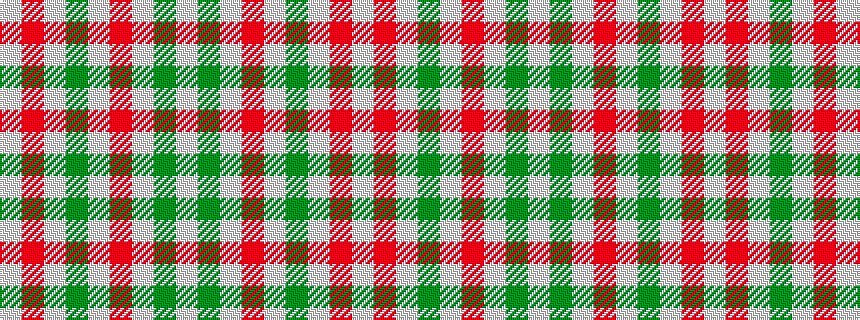

WGWRWGWRW

It is a 9 stripe tartan.

<figure class="pat-woven">

<figcaption>idealised sample</figcaption>
</figure>

## Colour Sequence



## Tartans with this colour sequence

| Tartans |
|---------------|
| [O'Neill](/variants/s9/w2o1w2g6w10o6w2g1w2~x2/)|
||
| [O'Neill Pipe Band 1999/ Oliver dress](/variants/s9/w2r1w2g6w10r6w2g1w2~x4/)|
||
