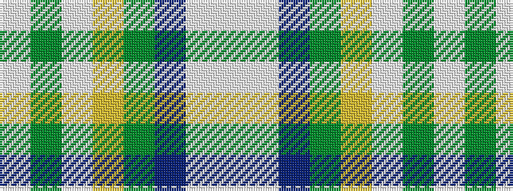

WGWYGBWW

It is a 8 stripe tartan.

<figure class="pat-woven">

<figcaption>idealised sample</figcaption>
</figure>

## Colour Sequence



## Tartans with this colour sequence

| Tartans |
|---------------|
| [Philpotts, Brian](/variants/s8/w8lt24db21g18lo4lb3dy2lbi1~x2/)|
||
