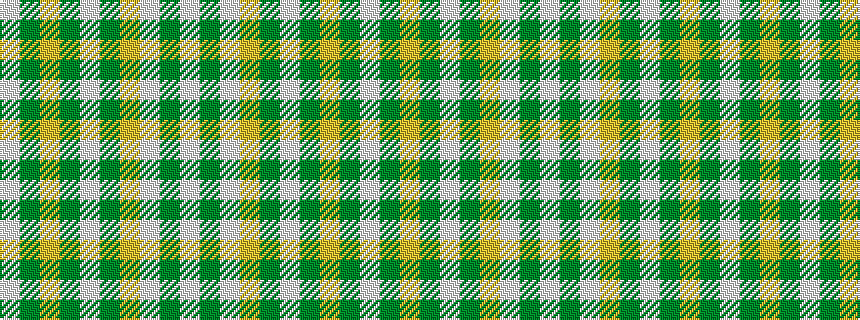

WGWYGWGYGW

It is a 10 stripe tartan.

<figure class="pat-woven">

<figcaption>idealised sample</figcaption>
</figure>

## Colour Sequence



## Tartans with this colour sequence

| Tartans |
|---------------|
| [Loch Skene (Fashion)](/variants/s10/lb48dy15lo2dy3lb2dy3loi12lb8dy2lb6~x2/)|
||
