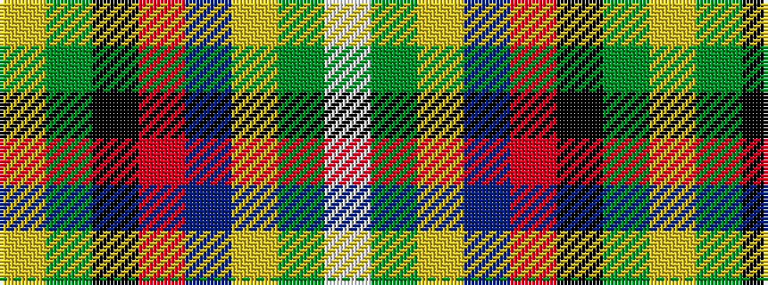

WGYBRKGY

It is a 8 stripe tartan.

<figure class="pat-woven">

<figcaption>idealised sample</figcaption>
</figure>

## Colour Sequence



## Tartans with this colour sequence

| Tartans |
|---------------|
| [Climb, The](/setts/s8/lg2dg9k16r2t30lg3dg6w1~x2/)|
||
