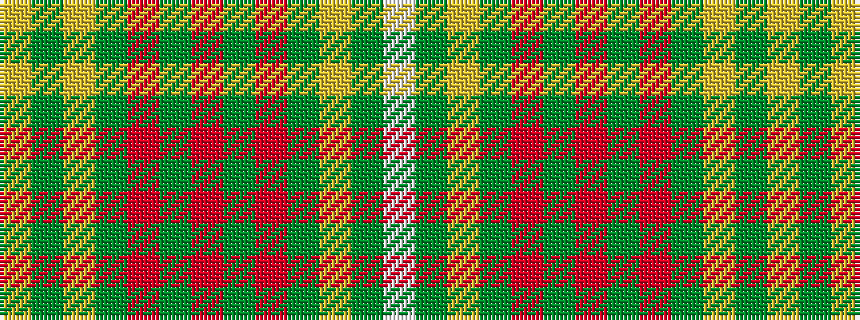

WGYGRGRGRGYGY

It is a 13 stripe tartan.

<figure class="pat-woven">

<figcaption>idealised sample</figcaption>
</figure>

## Colour Sequence



## Tartans with this colour sequence

| Tartans |
|---------------|
| [Buglass](/variants/s13/lo3g1lo1g14o2g2o2g4o11dg25ly2dg3w2~x2/)|
||
