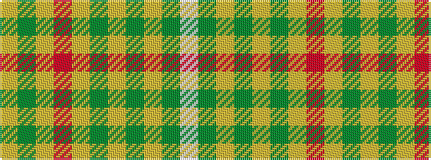

WGYGYGYRYGY

It is a 11 stripe tartan.

<figure class="pat-woven">

<figcaption>idealised sample</figcaption>
</figure>

## Colour Sequence



## Tartans with this colour sequence

| Tartans |
|---------------|
| [Connacht (District) (Smith)](/variants/s11/lo15g6lo1r1lo1g6lo15y2lo1y6w1~x4/)|
||
| [Connaught](/variants/s11/lo15g6lo1r1lo1g6lo15dy2lo1dy6w1~x4/)|
||
