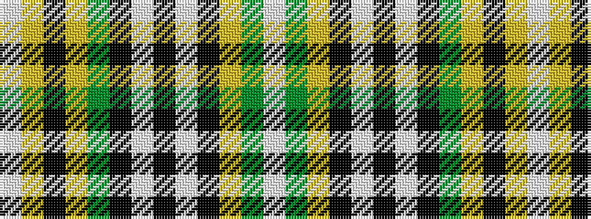

WGYKWKWKGYKYW

It is a 13 stripe tartan.

<figure class="pat-woven">

<figcaption>idealised sample</figcaption>
</figure>

## Colour Sequence



## Tartans with this colour sequence

| Tartans |
|---------------|
| [O'Farrell Irish Family Tartan](/variants/s13/w2dy14ly3k6w2k2w2k2g8lo6k2lo3w2~x2/)|
||
