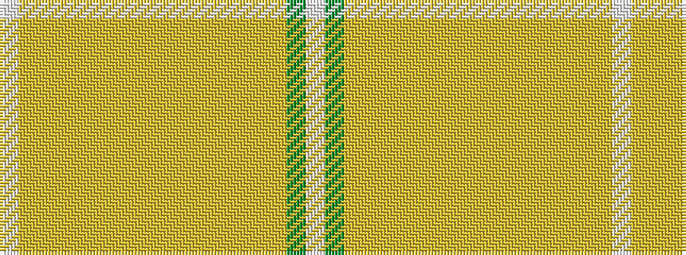

WGYYYYYYYYYYYYYYW

It is a 17 stripe tartan.

<figure class="pat-woven">

<figcaption>idealised sample</figcaption>
</figure>

## Colour Sequence



## Tartans with this colour sequence

| Tartans |
|---------------|
| [Green Thistle](/variants/s17/w3dg15lr12lyi1lr1lyi1lr1lyi1lr1lyi1lr1lyi1lr1lyi3ly3lyi15w3~x2/)|
||
