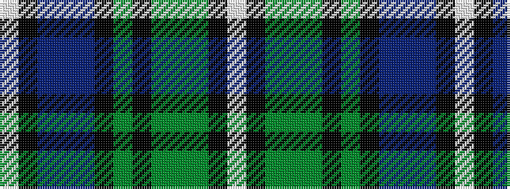

WKBBBKGKGGGKW

It is a 13 stripe tartan.

<figure class="pat-woven">

<figcaption>idealised sample</figcaption>
</figure>

## Colour Sequence



## Tartans with this colour sequence

| Tartans |
|---------------|
| [Dyer](/variants/s13/w2k1dg4g4dg4k1dg1k1db4t5db4k1w1~x4/)|
||
