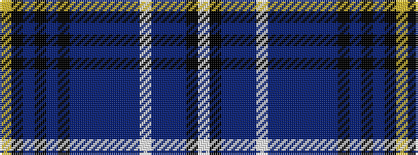

WKBBBWBBBBBBKBKBKY

It is a 18 stripe tartan.

<figure class="pat-woven">

<figcaption>idealised sample</figcaption>
</figure>

## Colour Sequence



## Tartans with this colour sequence

| Tartans |
|---------------|
| [Van Ingelgem Dress (Personal)](/variants/s18/ly3k18dt3k3dt3k3dt17db3dt3db3dt3db12w2db12dt9db12k2w2~x2/)|
||
