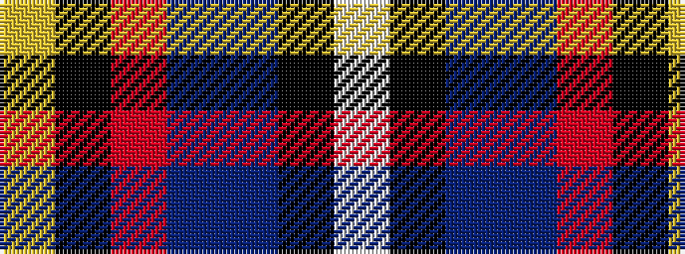

WKBBRKY

It is a 7 stripe tartan.

<figure class="pat-woven">

<figcaption>idealised sample</figcaption>
</figure>

## Colour Sequence



## Tartans with this colour sequence

| Tartans |
|---------------|
| [George Heriot's School](/setts/s7/w3k1db24db10o24k1ly3~x2/)|
||
