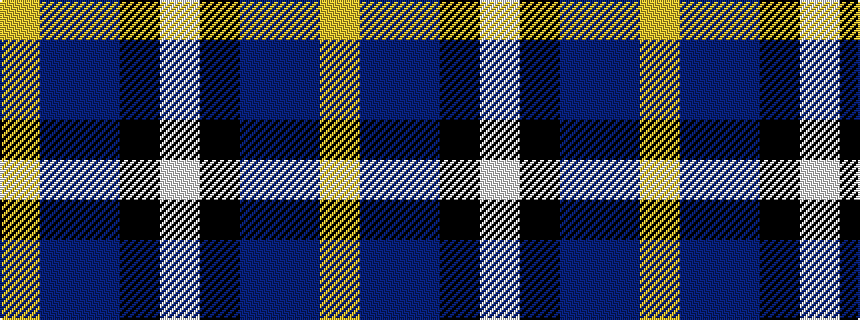

WKBBY

It is a 5 stripe tartan.

<figure class="pat-woven">

<figcaption>idealised sample</figcaption>
</figure>

## Colour Sequence



## Tartans with this colour sequence

| Tartans |
|---------------|
| [Teylu Coleman (Cornwall)](/variants/s5/w3k25do9dp17ly3~x2/)|
||
| [Teylu Coleman (Name)](/variants/s5/ly3dt17n9k25lb3~x2/)|
||
