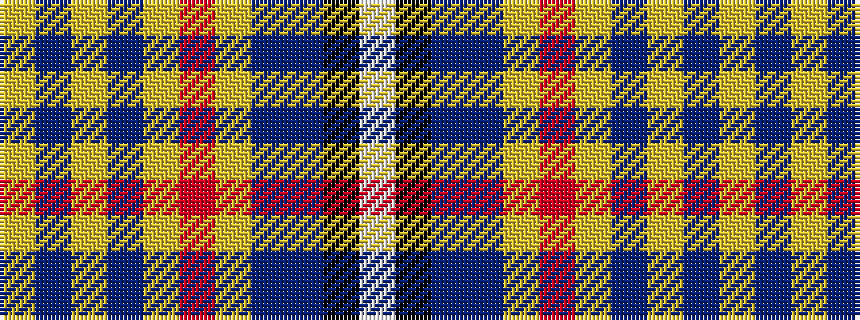

WKBBYRYBYBY

It is a 11 stripe tartan.

<figure class="pat-woven">

<figcaption>idealised sample</figcaption>
</figure>

## Colour Sequence



## Tartans with this colour sequence

| Tartans |
|---------------|
| [Congo, The Democratic Republic of the](/variants/s11/w4k1db16b20ly2r8ly2b20ly2b1ly4~x2/)|
||
