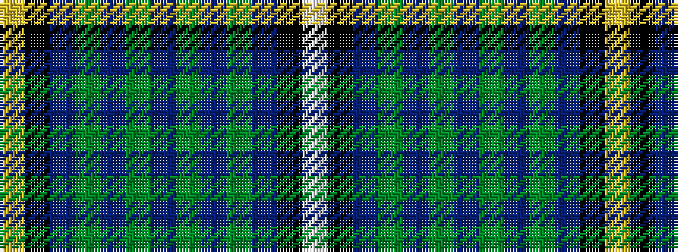

WKBGBGBGBGBKY

It is a 13 stripe tartan.

<figure class="pat-woven">

<figcaption>idealised sample</figcaption>
</figure>

## Colour Sequence



## Tartans with this colour sequence

| Tartans |
|---------------|
| [Campbell Brown Personal Tartan Tartan Number: 17. Earliest known date: pre 1992 Specially made for Captain Campbell of the Blythswood family. See products available Copyright © Blair Urquhart, Comrie, 2015](/setts/s13/w9k1dr31g30db36g3db3g3db36g30dr31k1ly9~x2/)|
||
