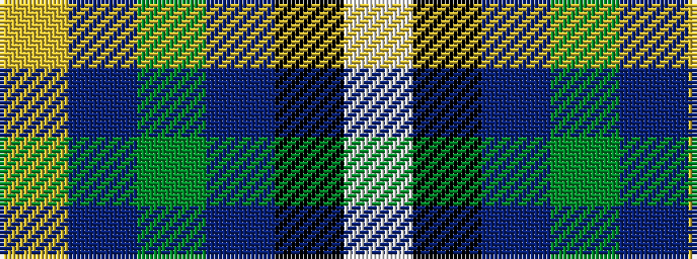

WKBGBY

It is a 6 stripe tartan.

<figure class="pat-woven">

<figcaption>idealised sample</figcaption>
</figure>

## Colour Sequence



## Tartans with this colour sequence

| Tartans |
|---------------|
| [Edgar-Feyen](/setts/s6/w18k1db4g4p10lo2~x4/)|
||
| [Edgar-Feyen (Personal)](/setts/s6/w18k1db4g4dp10lo2~x4/)|
||
