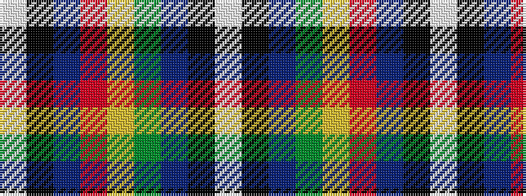

WKBGYRBKW

It is a 9 stripe tartan.

<figure class="pat-woven">

<figcaption>idealised sample</figcaption>
</figure>

## Colour Sequence



## Tartans with this colour sequence

| Tartans |
|---------------|
| [Stott (Personal)](/variants/s9/w2k25dt2dg6ly2r6dt2k25w2~x2/)|
||
