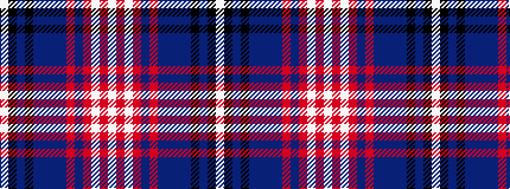

WKBKBBBBRBRWRW

It is a 14 stripe tartan.

<figure class="pat-woven">

<figcaption>idealised sample</figcaption>
</figure>

## Colour Sequence



## Tartans with this colour sequence

| Tartans |
|---------------|
| [Snowy Owl](/variants/s14/w40o1w6o3n1o7n3do1n8do3k1do9k2w8~x2/)|
||
