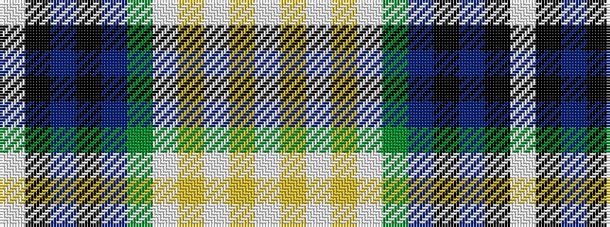

WKBKBGWYWYW

It is a 11 stripe tartan.

<figure class="pat-woven">

<figcaption>idealised sample</figcaption>
</figure>

## Colour Sequence



## Tartans with this colour sequence

| Tartans |
|---------------|
| [Fitzpatrick](/setts/s11/w6ly2w2ly3w11g11b2k12b3k6w2~x2/)|
||
| [Fitzpatrick](/setts/s11/w6ly2w2ly3w11g11db2k12db3k6w2~x2/)|
||
