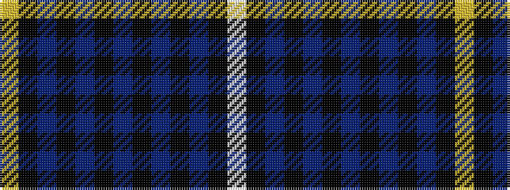

WKBKBKBKBKBKY

It is a 13 stripe tartan.

<figure class="pat-woven">

<figcaption>idealised sample</figcaption>
</figure>

## Colour Sequence



## Tartans with this colour sequence

| Tartans |
|---------------|
| [Swedish](/setts/s13/ly7k1db22k2db1k2db4k2db1k2db4k18w5~x2/)|
||
