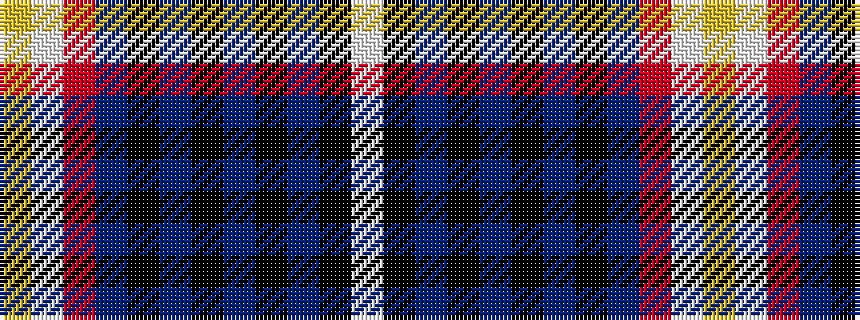

WKBKBKBKBRWY

It is a 12 stripe tartan.

<figure class="pat-woven">

<figcaption>idealised sample</figcaption>
</figure>

## Colour Sequence



## Tartans with this colour sequence

| Tartans |
|---------------|
| [Aberdeen Forever](/setts/s12/ly4w2r19n8k1n3k2n2k3n2k26lb4~x2/)|
||
