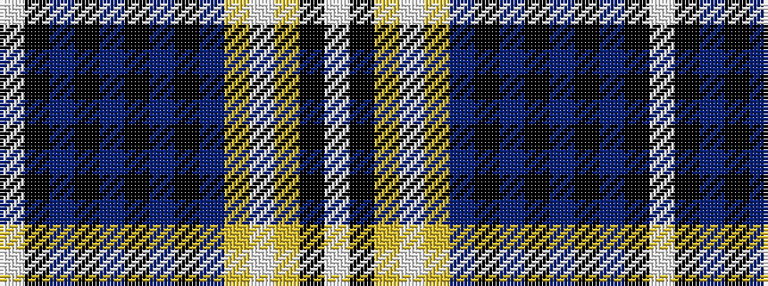

WKBKBKBKBYWYKW

It is a 14 stripe tartan.

<figure class="pat-woven">

<figcaption>idealised sample</figcaption>
</figure>

## Colour Sequence



## Tartans with this colour sequence

| Tartans |
|---------------|
| [Avalon - Carroll House](/setts/s14/w3k1b15k6b5k3b8k2b5ly3w2ly4k1w3~x2/)|
||
